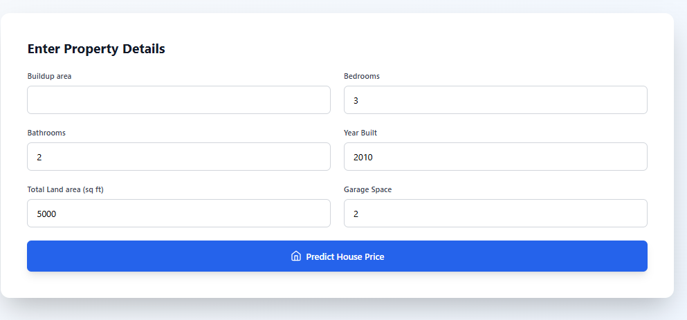
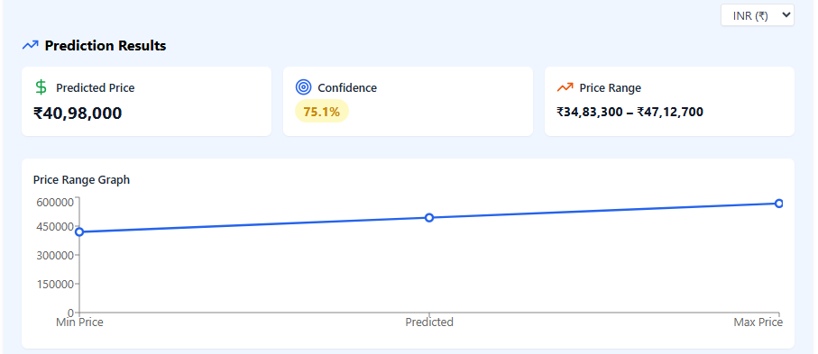

🏡 House Price Prediction – Internship Project

    A modern, interactive web application that predicts house prices based on key property features such as square footage, bedrooms, bathrooms, lot size, and year built.
The system uses machine learning to generate accurate predictions and provides confidence scores, price ranges, and data visualisation.

🚀 Live Demo

    🔗 (https://internship-seven-pi.vercel.app/)

📌 Project Overview

    This project is built as part of my internship to demonstrate the use of React, Vite, TypeScript, and ML-based APIs.
    Users can enter property details and instantly receive:

    Estimated house price

    Min–max price range

    Confidence percentage

    Price range graph

    Multi-currency support (INR, USD, EUR, GBP)

    The UI is clean, responsive, and optimised for professional use.

✨ Key Features
🧠 1. Machine Learning-Based Price Prediction

    Predicts home prices using a trained ML model served through a backend API.
Outputs include:

    Predicted price

    Price range (min–max)

    Confidence score

🎨 2. Beautiful Modern UI

    Built using React + TypeScript + Vite

    Styled with Tailwind CSS

    Supports mobile, tablet, and desktop

    Clean card layout and smooth interactions

💱 3. Multi-Currency Support

    Switch between:

        INR ₹

        USD $

        EUR €

        GBP £

Formatted properly per locale (₹3,33,333 / $1,111,111 / €1.111.111).

📈 4. Price Range Graph

    Displays a visual line chart showing:

    Minimum price

    Predicted price

    Maximum price

    Built using Recharts.

🧹 5. Smart Input Handling

    Supports ANY number inputs

    Removes leading zeros automatically

    Allows empty input fields

    No forced rounding

    Clean numeric validation

🛠️ Tech Stack
    Frontend

    React.js

    TypeScript

    Vite

    Tailwind CSS

    Lucide Icons

    Recharts

    Backend / ML

    Custom ML model (served through an API)

    Python (Model development)

    FastAPI / Flask (for serving predictions)

📁 Project Structure
        src/
            ├── components/
            │    ├── PredictionForm.tsx
            │    ├── PredictionResult.tsx
            ├── services/
            │    ├── mlService.ts
            ├── App.tsx
            ├── main.tsx
            └── index.css

🧪 How to Run Locally

    1️⃣ Clone the repository
    git clone https://github.com/iPraJosh/Internship.git
    cd Internship

    2️⃣ Install dependencies
    npm install

    3️⃣ Start the development server
    npm run dev

    4️⃣ Open the app

    Go to the URL shown in terminal:

    http://localhost:5173

🔥 Deployment Instructions
    Deploy Easily on Vercel

    Go to https://vercel.com

    Click New Project

    Import your GitHub repo

    Vercel auto-detects Vite + React

    Add environment variables if needed

    Click Deploy

    You’ll get a professional URL you can share with your professor.

📸 Screenshots

     
     

📚 Future Enhancements

    Add EMI Calculator

    Add city-based price adjustment (Chennai, Bangalore, Mumbai)

    Add Heatmap / Feature Importance Chart

    Save prediction history

    Download prediction as PDF report

🧑‍💻 Author

    Praveen Joshua
    Internship Project – 2025
